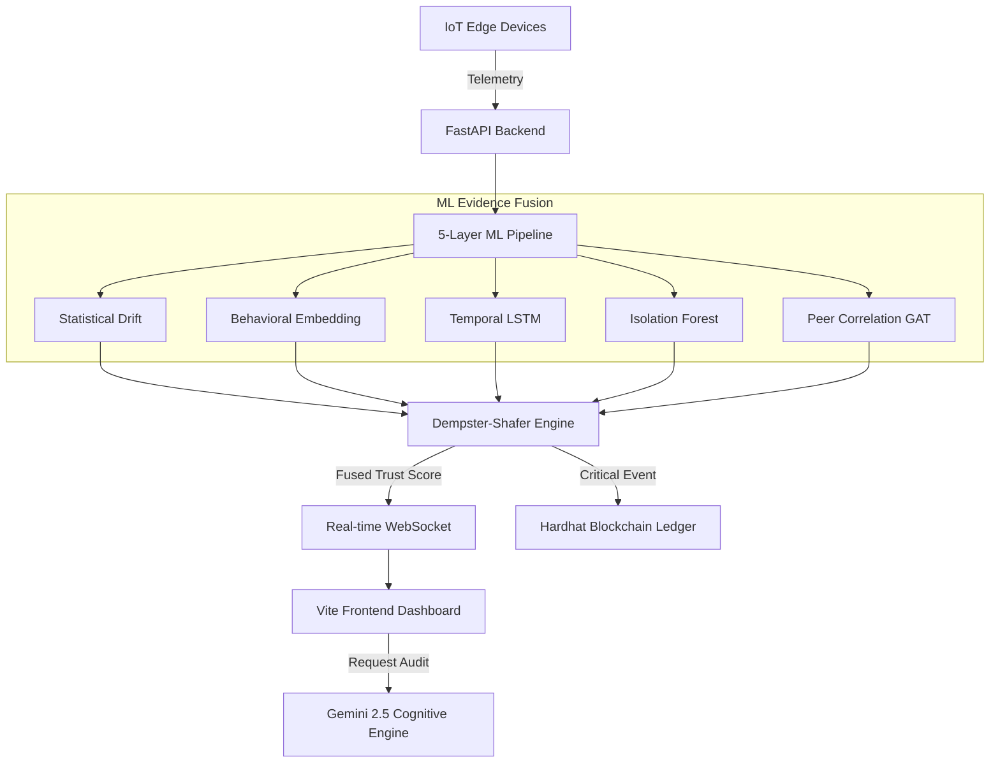

# 🛡️ GhostPrint MLE: SurakshaKavach
> **Advanced IoT Security Intelligence & Cognitive Cyber Defense Platform**

SurakshaKavach (GhostPrint MLE) is a state-of-the-art security monitoring system designed for mission-critical IoT environments. It leverages a multi-layer machine learning pipeline, real-time behavioral analytics, and blockchain-backed immutable auditing to detect and mitigate sophisticated cyber threats before they propagate.

---

## 🚀 Core Capabilities

- **✨ Cognitive AI Audit**: Integrated with Google Gemini 2.5 to provide natural language explanations of complex anomalies and recommended mitigation steps.
- **📊 5-Layer ML Evidence Fusion**: Uses Dempster-Shafer theory to resolve uncertainty across specialized detection layers (Statistical, Behavioral, Temporal, Point, and Peer Correlation).
- **🔗 Immutable Blockchain Ledger**: All security critical events are logged on-chain via Solidity smart contracts, ensuring a tamper-proof audit trail for forensic analysis.
- **🛡️ Real-time Threat Propagation Map**: Visualizes the potential spread of attacks across device clusters using Graph Attention Networks (GAT).
- **⚡ Proactive Defense**: Categorical security partitioning automatically isolates critical threats from nominal operations.

---

## 🛠️ Technology Stack

| Component | Technology |
| :--- | :--- |
| **Frontend** | React, Vite, TailwindCSS, Recharts, Framer Motion |
| **Backend** | FastAPI (Python 3.11), WebSockets, NumPy, Scikit-Learn, PyTorch |
| **Intelligence** | Google Gemini 2.5 Pro (Generative AI SDK) |
| **Blockchain** | Hardhat, Solidity (EVM-compatible) |
| **Communication** | Real-time WebSocket Data Synchronization |

---

## 🏗️ Technical Architecture



---

## ⚡ Quick Start Guide

### 1. Intelligence Setup
Ensure you have a `.env` file in the root with your Gemini API Key:
```env
VITE_GEMINI_API_KEY=your_key_here
```

### 2. Backend Strategy (Python 3.11)
```bash
cd backend
python -m venv .venv
source .venv/bin/activate  # Or .venv\Scripts\activate on Windows
pip install -r requirements.txt
python main.py
```
*API Docs available at: `http://localhost:8000/docs`*

### 3. Frontend Deployment
```bash
cd frontend
npm install
npm run dev
```
*Access the dashboard at: `http://localhost:5173`*

### 4. Blockchain Audit (Optional)
```bash
cd Blockchain
npm install
npx hardhat node  # Starts local EVM node
# In another terminal:
npx hardhat run scripts/deploy.js --network localhost
```

---

## 📈 ML Pipeline Detail

1. **Statistical Drift (ADWIN)**: Detects non-stationary distribution shifts in traffic patterns.
2. **Behavioral DNA (UMAP/HDBSCAN)**: Maps feature space to project behavioral deviations from class baselines.
3. **Temporal Anomaly (LSTM Autoencoder)**: Flags sequences that deviate from historical device-specific timing.
4. **Point Outliers (Isolation Forest)**: High-resolution detection of extreme univariate and multivariate outliers.
5. **Peer Correlation (GAT)**: Identifies coordinated attacks propagating across similar device clusters.

---

## 📝 License
This project is developed for advanced security research. All rights reserved.
